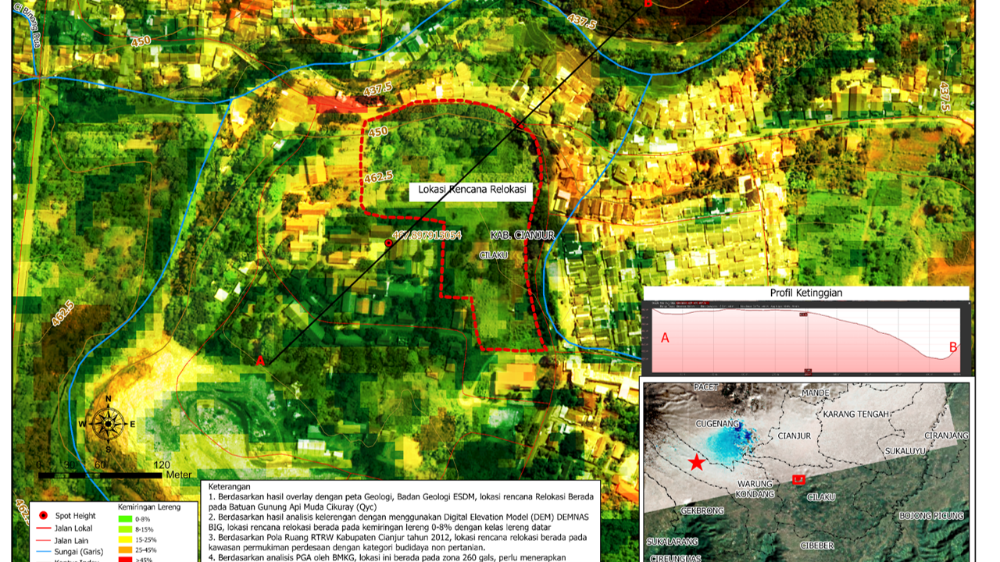

# Relocation-Site-Analysis-for-Earthquake-Affected-Residents-in-Cianjur-West-Java (2023)
This project presents a GIS-based spatial analysis to assess the suitability of a proposed relocation site for communities affected by the Cianjur earthquake in 2023. The analysis integrates geological, topographical, spatial planning, seismic hazard, and environmental proximity data to support risk-informed post-disaster resettlement planning.

## Project Description
This project presents a GIS-based spatial analysis to identify suitable relocation sites for communities affected by the Cianjur earthquake. The analysis applies multi-criteria decision analysis (MCDA) by integrating geological, topographical, spatial planning, seismic hazard, and environmental proximity data to support risk-informed post-disaster resettlement planning.
The final output includes suitability maps that classify potential relocation areas based on safety, accessibility, and environmental constraints. This project aims to support post-disaster recovery planning and risk-informed decision-making.

## Key Obejctive
- Evaluate the suitability of a proposed relocation site using spatial analysis
- Ensure compliance with regional spatial planning regulations
- Assess potential geological and seismic risks
- Support safe and sustainable post-earthquake resettlement

## Data & Methods
**Data Sources:**
- Geological Map — Geological Agency of ESDM
- Digital Elevation Model (DEMNAS) — BIG
- Spatial Plan (RTRW) of Cianjur Regency (2012)
- Peak Ground Acceleration (PGA) data — BMKG
  
**Methods:**
- Spatial overlay analysis
- Slope classification derived from DEM
- Spatial conformity analysis with RTRW
- Seismic hazard assessment using PGA data
- Proximity analysis to environmental facilities
  
## Tools:
- ArcGIS
  
## Analysis Results
- The proposed relocation site is located on Young Volcanic Rock (Qyc) based on geological analysis, indicating relatively stable ground conditions with appropriate engineering considerations.
- Slope analysis using DEMNAS shows that the site has a 0–8% slope, classified as flat terrain and highly suitable for settlement development.
- According to the Cianjur Regency Spatial Plan (RTRW) 2012, the site is designated as a rural settlement area within a non-agricultural cultivation zone, confirming spatial planning compliance.
- Based on BMKG PGA analysis, the site is located within Zone 260 gal, indicating the necessity of earthquake-resistant building design.
- The distance between the proposed relocation site and Pasir Sembung landfill (TPA) is approximately 177.30 meters, which should be considered in environmental and health assessments.

## Outputs
The maps below represent the final outputs of the GIS-based spatial analysis. The map highlights specific spatial factors used in evaluating the suitability of the proposed relocation site.

### Relocation Site Suitability Map

  
